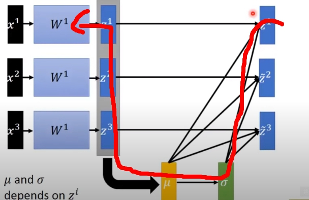

# 從 BN 到 LN

<br>

---

<br>

論文 : [《Batch Normalization: Accelerating Deep Network Training b y Reducing Internal Covariate Shift》](https://arxiv.org/pdf/1502.03167.pdf)

文中圖片資源取自 : [Batch Normalization by Hung-yi Lee](https://www.youtube.com/watch?v=BZh1ltr5Rkg)

<br>

---

<br>

在研究機器翻譯建模時，遇到了一個遇到一個陌生名詞，叫做 Layer Normalization （後統稱　LN）。後來去查閱資料後，發現這個觀念非常重要，並且是由 Batch Normalization（後統稱　BN） 演化而來，所以這邊就來就紹一下 BN 與 LN。


<br>
<br>

## Feature Scaling

<br>

要想了解 __BN__，我們必需要先知道 Feature Scaling 的概念。這部分在時做篇筆記波士頓房價預測就有實現過，有需要可以去參考看看。這邊一樣還是以觀念為主。

我們舉一個例子，在我們一般拿到的訓練資料中，不免會看到許多資料 Scale 差距很大的情況。例如說 "犯罪率" 的取值範圍會是 0~1 之間的 float32 ; "占地面積" 的取值範圍會是 1~1000 坪米。這就是所謂的 Scale 差距很大的狀況。那 Scale 差距過大意味著甚麼呢 ? 

<br>

先看一下圖示 : 


x1 值基本上是在 1, 2, 3 ... 浮動，x2 基本上是 x1 的 100 倍，這樣會造成一個問題。Model 的權重值 W1 會變得相對很不敏感，W2 則會很活躍。因為 x1 很小嘛，所以 W1 相對去做調整對結果實際上影響不大，而 W2 地位就不一樣了，因為 X2 相對較大，所以只要動一點點就會對結果造成很大的影響。

<br>

把 W1 W2 對應 Loss 的關係畫出來會向下面這樣 :  


可以看到，損失函數變橢圓形，甚麼意思呢，Loss 在 W2 上的斜率變化比較大，因為 X2 大小對結果影響大，W1 則反果來，因為 X1 值太小，所以需要調整的角度不大，所以 Loss 上的斜率較小。

<br>

有人就會說了，那這樣會有事嗎，丟給機器還不是一樣算 ? 其實影響差很多喔，試想一下給 Model 的 Learning rates 要怎麼調 ? 本來二者之間調整的 range 就差很多，總不可能 W2 跟 W1 給一樣的 Learning rates 吧...解決辦法就是給 W2 一個比較大的 learning rates，W2 一個比較小的 learning rates。

<br>
<br>

如果我們讓不同 feature 有幾乎相同的 Scale 結果可能會更好喔，我們把 X2 的值同除以 100 : 


此時再把 W1 W2 對應 Loss 值關係話出來會是這樣 :


變成圓形了，這代表我們只需要給所有的 Model 參數調整的方向上設定同樣的 learning rates 就好了，不用變得那麼麻煩。

<br>
<br>

了解過 feature scaling 的必要性後，現在要來說明一下如何正確地做 feature scaling。feature scaling 的中心思想是，讓訓練資料以 __0__ 為出發點，以 __標準差__ 為單位。如果馬上看懂了應該會覺得這不就是基礎統計學嗎 ? 就是這樣，舉例來說我們今天有 2 筆資料如下 : 

```py
a = [1, 2, 3]
b = [100, 200, 300]
```

我們分別算出 a 與 b 的平均值(mean) 與標準差(std)。


```py
mean_a = 2 
std_a = 1

mean_b = 200
std_b = 100
```

現在我們對 a 與 b 分別套用一個公式 `x = (x-mean) // std` 這個公式數學系的應該看不懂...ㄎㄎ。結果如下 :

```py
new_a = [-1, 0, 1]
new_b = [-1, 0, 1]
```

不用多說想必也能看懂，所謂的 _讓訓練資料以 __0__ 為出發點，以 __標準差__ 為單位_ 是甚麼意思。

<br>
<br>
<br>
<br>

## 深度學習中的 Feature Scaling

<br>

把這個觀念帶到深度學習的層與層之間，每一層的輸出會是下一層的輸入（feature），我們可以對每一層的輸入做一次 feature scaling :


<br>

在層與層之間做 feature scaling 可以有效避免 __Internal Covariate Shift__ 的問題。關於這個問題，這邊又要再解釋拉 ! 

<br>

### Internal Covariate Shift

想像一下上圖中的 layer1 與 Layer2 是路上的兩個行人，當他們兩個走路面對面快撞到時，Layer1 往左閃，Layer2 往右閃，他們兩個就還是撞到一起，為甚麼舉這個例子呢 ? 當我們的兩個 Layer 需要調整參數時，一個往左調了另一個也會往右調，那兩個都調就可能會發生 "對撞" 問題，就是說兩個調了等於沒調，還是錯。這就是 Internal Covariate Shift。

<br>

那再想一個問題，今天我們對每一層的 input 做 feature scaling 的話，那是不是要考慮他們的 mean 跟 std 呢，當訓練資料不變的情況下，Model 會不斷更新 Layer 的參數 (w)，所以這會導致 mean 與 std 也不停變換。這導致我們沒辦法很簡單的一下子知道 mean 與 std 是多少，進而去減掉除掉它們，所以我們需要新的技術 : __Batch Normalization__。

<br>

Batch Normalization 其實觀念蠻簡單的，看圖說故事 :


可以看到圖片中的兩個重要參數 : __μ__（mean） 丶 __σ__（std）。x1~x3 分別是 3 筆訓練資料，綁成一個批次送進來 Model 做運算。當我們算出了 μ 與 σ 之後，我們就可以對 z1~z3 的輸出做 feature scaling :


那算出的結果就可以做為下一個 Layer 的輸入了。那有人就會問了，這跟前面提到解決 mean 與 std 不斷改變的問題有甚麼關係 ? 再回去看上圖，當神經反饋給 Layer 修改參數 W 時，會從尾巴流回到 W 那邊 :



這樣一來連 __μ__ 丶 __σ__ 也都會憶起被更新。為甚麼會這樣呢，因為 σ 依賴於 μ，而 μ 依賴於 z，所以當反饋神經使 W 更新了，z 往後的東西也都一起更新。

<br>
<br>
<br>

### Batch Normalization 優勢

<br>

* 減少訓練時間，使更深度網路有可訓練性。（因為減少了 Covariate Shift，所以我們可以用更大的 learning rates）

* 減少 Gradient vanishing（梯度消失） 或 exploding（梯度爆炸） 的問題產生

<br>

### Batch Normalization 優勢

<br>

* BN 依賴於 Batch Size，當 Batch Size 小的時候效果不理想。

* BN 不適合拿來處理 seq 網路 e.g RNN。

* BN 只有在 Model 訊練階段可以使用，實際部屬使用 Model 時不會用到。

<br>
<br>
<br>
<br>

----

<br>
<br>

## Layer Normalization

<br>

講到 LN，就必須要再提一下 BN 的缺點，就是其可信程度受到 Batch Size 影響很大。如果對小的批次資料做 BN 那樣會對整體資料均值平方差偏差很大，重點要說的就是 __BN 極度依賴批次大小__。而且 BN 不是合用於 RNN 網路。

<br>

Layer Normalization 的提出解決了 BN 出現的這兩個問題。首先我們要先了解一點，BN 算平均與標準差是拿批次裡面同種資料來算的，講白話一點，假如現在資料集中有 2 欄資料，一個是 "犯罪率"，另一個是 "占地坪數"。BN 會計算這一個批次的 "犯罪率" 與 "占地坪數" 的標準差與平均值。

LN 像是對輸入資料做了一次轉置，對同一層網路的輸出做標準化（或者叫 feature scaling）。講白話，我們直接拿一筆 input 資料，算 "犯罪率" 與 "占地坪數" 的標準差與平均數。這樣懂了嗎 ? 所以才說是做轉置。這樣一來就不受 batch_size 影響了，而且可用於 RNN。


