# Machine Translate 介紹

<br>

參考來源 : [淺談神經機器翻譯 & 用 Transformer 與 TensorFlow 2 英翻中（by LeeMeng）](https://leemeng.tw/neural-machine-translation-with-transformer-and-tensorflow2.html)

感謝 LeeMeng 大神對社群的分享貢獻，這裡對閱讀完文章之後做一個自己的總結。並補充修正一些實作上的問題。

<br>

環境部屬: 

* Tensorflow-gpu==2.0.0

* CUDA==10.0

* cudnn==7.4 (for CUDA10)

* Tensorflow-datasets==2.1.0

* 系統環境 : Windows 10

* GPU : __NVIDIA 有支援CUDA的任何一款都可以__

以上環境必須版本完全相同才可以，本人親自實測可行，只要任何一個差一個版號就 GG。

筆記日期為 2020/08/13。

<br>
<br>

---

<br>
<br>

## 一丶翻譯模型架構

本次 lib 實作英翻中機器翻譯。

在參考原文中提到機器翻譯最重要的核心概念就是 __Transformer__ 。這邊先簡單的做一張圖來大概說明一下 Transormer 架構中會出現的 Model 與其位置。

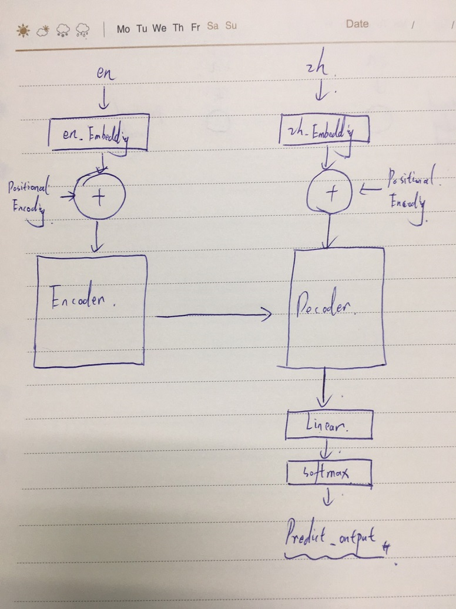

總體上來說，一個機器翻譯的該有的架構就是長這樣。但是還是有很多細節沒提到，Encoder 與 Decoder 的是機器翻譯的核心。

這邊看不懂沒關係，接下來就是一步一步的介紹它們了。

<br>
<br>

---

<br>
<br>

## 二丶資料前置整理

首先我們要先從訓練資料入手，我們的訓練資料來源於 Tensorflow 提供給 MT 訓練的新聞類資料。這邊直接點開 .txt 檔看一下。

[wmt.txt](wmt.txt)

我們取出開頭 1 筆資料來看一下 : 

    The fear is real and visceral, and politicians ignore it at their peril.	這種恐懼是真實而內在的。 忽視它的政治家們前途堪憂。

英文在前中文在後，中間以 '\t' 相隔，有了資料之後，我們就該思考如何去使用它們，讓機器理解他們。

<br>

### 字典的建立


首先做 NLP 必須要有的一個概念是，我們不可能直接把文字丟給模型，叫它直接給我算出東西來。我們必須要建立字典，並將一句話先轉換成字典對應的 indices。

我們以英文舉例，我們先循遍所有資料，對看到的所有單字做放入字典的工作:

    How are you ?
    I'm fine thanks, and you ?

    # 以上 2 句話會被用以建立字典集
    en_vocab = {
        "How": 1, 
        "are": 2, 
        "you": 3, 
        "I'm": 4, 
        "fine": 5, 
        "thanks": 6, 
        "and": 7, 
        "?": 8,
        ",": 9
    }

基本上就是這樣一個概念。

當我們建立好字典之後，再來就是把文字資料 map 成純數字了，不用多說大家也都知道該怎麼做。

    "How are you ?" -> [1, 2, 3, 8]
    "I'm fine thanks, and you ?" -> [4, 5, 6, 9, 7, 3, 8]

<br>

### BOS & EOS

當機器在翻譯時，產出的 output 是一個字一個字蹦出來的，那機器怎麼知道這句話到底翻沒翻完呢，或者說甚麼時候該停下了呢 ? 這個時候我們就要使用到 BOS & EOS 的概念了。

* BOS (Begin of sentence)

* EOS (End of sentence)

我們要在一個句字前後加入分別加入標記，像下面這樣 : 

    "How are you ?" -> "<BOS> How are you ?<EOS>"

由於我們最終還是要把它變成字典，所以我們可以直接把 BOS & EOS 放到字典最後 2 個位置。假如我們字典大小目前是 9 好了，那麼 BOS 對應數字就是 10，EOS 則是 11。

所以現在會是這樣: 

    "<BOS> How are you ?<EOS>" -> [10, 1, 2, 3, 8, 11]

<br>

### 長度問題

好，第一步完成，接下來思考一下，我們要餵這些長短不一的資料給 Model，那 Model 吃進去的資料可不可以是長度不斷改變的呢 ? 答案是不行的，model 在設計之初就要指定 `input_shape` 了，不可以動態改變。

所以我們要做的下一步就是把資料長度給固定住。比如說我們限制資料長度我們取 10 個 tokens，那如果你的資料 tokens 大於 10 了就過濾掉不用，長度小於10的呢，後面補 0 。我們就拿上面兩個句字舉例:


|原文|加入 BOS&EOS|fix Len|
|-	|-	|-	|
|"How are you ?"|[10, 1, 2, 3, 8, 11]|[10, 1, 2, 3, 8, 11, 0, 0, 0, 0]|
|"I'm fine thank, and you ?"|[10, 4, 5, 6, 9, 7, 3, 8, 11]|[10, 4, 5, 6, 9, 7, 3, 8, 11, 0]|


這樣一來，我們就可以保證資料長度一致都是 10 了。

<br>
<br>

### 實作

讀入資料到 tensorflow-datasets
```py
import tensorflow as tf
import tensorflow_datasets as tfds


def prepareData(fileName):
    data_buff = []
    with open(fileName, 'r', encoding='utf-8') as file:
        line = file.readline()
        while line:
            line = line.replace("\n", "")  # 去掉換行
            en_zh = line.split("\t")
            data_buff.append(en_zh)
            line = file.readline()
    return data_buff

def putDataIntoTFDS(data):
    dataset = tf.data.Dataset.from_tensor_slices((
        # 這邊讀入英文資料時一律轉小寫
        [str(en).lower() for en, zh in data], [zh for en, zh in data]
    ))
    return dataset
    
# 實際只要呼叫這個 func 就可以了
def get_MT_TFDS(filename):  
    data_buff = prepareData(filename)
    ds = putDataIntoTFDS(data_buff)
    return ds, len(data_buff)
```

<br>

字典建立

tensorflow 本身就已經為我們提供了一個不錯的字典建立套件 (ps: 載入地端字典時有一點小bug，找不到地端文件就直接崩潰，連錯誤 console 都沒有)，直接拿來用就好，細節不多說，看 code 就懂。

```py
# 建立 or 載入英文字典，目前英文字典大小為 2 的 14 次方。
def build_en_vacab(en_vocab_file, train_examples):
    print("build_en_vacab..")
    subword_encoder_en = None
    if os.path.exists(en_vocab_file):
        subword_encoder_en = tfds.features.text.SubwordTextEncoder.load_from_file(en_vocab_file)
        print(f"載入已建立的字典： {en_vocab_file}")
    else:
        print("未找到現有 en 字典，開始建立字典。")
        subword_encoder_en = tfds.features.text.SubwordTextEncoder.build_from_corpus(
            (str(en.numpy()).lower() for en, zh in train_examples),
            target_vocab_size=2 ** 14 # 字典最大 size
        )
        # 存檔
        subword_encoder_en.save_to_file(en_vocab_file)
    print(f"字典大小：{subword_encoder_en.vocab_size}")
    print(f"前 10 個 subwords：{subword_encoder_en.subwords[-10:-1]}")
    return subword_encoder_en


# 建立 or 載入中文字典，目前中文字典大小為 2 的 13 次方。
def build_zh_vacab(zh_vocab_file, train_examples):
    print("build_zh_vacab..")
    subword_encoder_zh = None
    if os.path.exists(zh_vocab_file):
        subword_encoder_zh = tfds.features.text.SubwordTextEncoder.load_from_file(zh_vocab_file)
        print(f"載入已建立的字典： {zh_vocab_file}")
    else:
        print("未找到現有 zh 字典，開始建立字典。")
        subword_encoder_zh = tfds.features.text.SubwordTextEncoder.build_from_corpus(
            (zh.numpy() for en, zh in train_examples),
            target_vocab_size=2 ** 14,
            max_subword_length=1  # 一個中文字在字典中算一個單位。
        )
        # 將字典檔案存檔
        subword_encoder_zh.save_to_file(zh_vocab_file)
    print(f"字典大小：{subword_encoder_zh.vocab_size}")
    print(f"前 10 個 subwords：{subword_encoder_zh.subwords[-10:-1]}")
    return subword_encoder_zh
```

<br>

定義一些之後在儲存檔案時會用到的路徑變數與超參數

這邊要注意 `BATCH_SIZE` 定義的越大，優化器對 Model 參數修改的頻率就會降低，但是訓練速度會提升。除此之外也需要考慮到機器性能問題，調太大會出現爆記憶體的問題。

```py
output_dir = "nmt"
en_vocab_file = os.path.join(output_dir, "en_vocab")
zh_vocab_file = os.path.join(output_dir, "zh_vocab")
checkpoint_path = os.path.join(output_dir, "checkpoints")
log_dir = os.path.join(output_dir, 'logs')


TOKEN_MAX_LEN = 80 # 句字最大的 token len
BATCH_SIZE = 64  # 64 筆資料綁成一批
BUFFER_SIZE = 3000 # 打亂資料用到的參數

# 讓 numpy 不要顯示科學記號
np.set_printoptions(suppress=True)

if not os.path.exists(output_dir):
    os.makedirs(output_dir)
```


讀入資料

```py
dataset, size = get_MT_TFDS("wmt.txt")
train_examples = dataset
```

<br>

建立或載入英文字典

```py
subword_encoder_en = build_en_vacab(en_vocab_file, train_examples)
subword_encoder_zh = build_zh_vacab(zh_vocab_file, train_examples)
```

<br>

為中英文句子加入 BOS EOS 的 encoder。

```py
def encode(en_t, zh_t):
    # 跟前面提到的一樣，BOS&EOS 就是字典到數 1 跟 2 
    en_indices = [subword_encoder_en.vocab_size] + subword_encoder_en.encode(en_t.numpy()) + [
        subword_encoder_en.vocab_size + 1]
    zh_indices = [subword_encoder_zh.vocab_size] + subword_encoder_zh.encode(zh_t.numpy()) + [
        subword_encoder_zh.vocab_size + 1]
    return en_indices, zh_indices
```

<br>

因為 tensorflow 是 graph 運算，不可以直接用 python code 操作字典，所以要用 tf.py_function 代理執行，至於 graph 運算，不懂的就可以直接理解為 tensorflow 在做玄學運算，已經把資料變成不是人類認知的東西了，所以不能直接以一般方式去操作它。
```py
def tf_encode(en_t, zh_t):
    return tf.py_function(encode, [en_t, zh_t], [tf.int64, tf.int64])
```

<br>

過濾掉長度大於 TOKEN_MAX_LEN 的例句。

```py
def filter_max_len(en, zh, max_len=TOKEN_MAX_LEN):
    return tf.logical_and(tf.size(en) <= max_len, tf.size(zh) <= max_len)
```

<br>

最終得到 Training data:
```py
train_dataset = (train_examples
                 .map(tf_encode)  # bos, eos
                 .filter(filter_max_len)  # 過濾長度
                 .cache()
                 .shuffle(BUFFER_SIZE)  # 重新打亂洗牌
                 .padded_batch(BATCH_SIZE, padded_shapes=([-1], [-1]))  # 綁批次包
                 .prefetch(tf.data.experimental.AUTOTUNE))
```

這邊重點注意一下我們的 train_dataset 是將資料以 `BATCH_SIZE` 大小把資料分批打包。這裡是以 64 筆為單位進行批次打包。

<br>

以上我們已經把前置作業整理好了，現在要正式進去主題了。真正的問題現在才要開始解決。

<br>
<br>

---

<br>
<br>


## 三丶理解 Embedding

還記得最上面畫出的 Transformer 圖嗎 ? 其中文字變成詞嵌入部分 : 

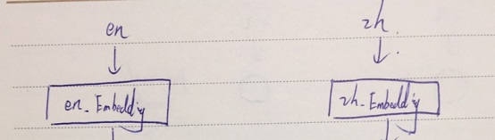

這邊如果不了解甚麼是 Word Embedding 的話，建議先看完以下學習資源 : 

[Unsupervised Learning - Word Embedding （by Hung-yi Lee）](https://www.youtube.com/watch?v=X7PH3NuYW0Q)

這邊重點講一下，現在大部分用的詞嵌入在現在不算是 deep-learning，老師影片中提到的詞嵌入 layer 只有一層。然後就是 Unsupervised Learning 了。甚麼是 Unsupervised Learning ? 簡單來說就是我們訓練過程中不需要給 model 一個實際的 Label 讓損失函數去算損失值來做調整，Model 看遍資料之後自己推算出詞向量。


這裡來實際建立使用看看 tensorflow.keras 提供的詞嵌入（word embedding）套件。

```py
# 建立測試資料
demo_examples = [
    ("It is important.", "這很重要。"),
    ("The numbers speak for themselves.", "數字證明了一切。"),
]

demo_examples = tf.data.Dataset.from_tensor_slices((
    [en for en, _zh in demo_examples], [zh for en, zh in demo_examples]
))


# 將兩個句子透過之前定義的字典轉換成子詞的序列（sequence of subwords）
# 並添加 padding token: <pad> 來確保 batch 裡的句子有一樣長度
demo_dataset = demo_examples.map(tf_encode).padded_batch(batch_size, padded_shapes=([-1], [-1]))

# 取出這個 demo dataset 裡唯一一個 batch
inp, tar = next(iter(demo_dataset))
print('inp:', inp)
print('' * 10)
print('tar:', tar)
```

輸出:

```
inp: tf.Tensor(
[[8135  105   10 1304 7925 8136    0    0]
 [8135   17 3905 6013   12 2572 7925 8136]], shape=(2, 8), dtype=int64)

tar: tf.Tensor(
[[4201   10  241   80   27    3 4202    0    0    0]
 [4201  162  467  421  189   14    7  553    3 4202]], shape=(2, 10), dtype=int64)
```

從上面我們可以看到，現在文字資料已經被我們轉換成數字序列了，接下來就是建立詞嵌入了。


```py
# + 2 是因為多了 <BOS>&<EOS>
vocab_size_en = subword_encoder_en.vocab_size + 2
vocab_size_zh = subword_encoder_zh.vocab_size + 2

# 為了方便, 只做一個 4 維詞嵌入空間(實務上要大很多)
d_model = 4
embedding_layer_en = tf.keras.layers.Embedding(vocab_size_en, d_model)
embedding_layer_zh = tf.keras.layers.Embedding(vocab_size_zh, d_model)

# 這邊我們把 inp 與 tar 資料直接塞給兩個詞嵌入層就可以了。
# 詞嵌入層會先幫我們把詞序列拿去做 encoding，然後返回對應值給我們。
emb_inp = embedding_layer_en(inp)
emb_tar = embedding_layer_zh(tar)
emb_inp, emb_tar
```

輸出:

```
emb_inp: tf.Tensor(
[[[ 0.00695511 -0.03370368 -0.03656032 -0.03336458]  # <BOS> -> 8135
  [-0.02707888 -0.03917687 -0.01213828  0.00909697]  # It -> 105
  [ 0.0355427   0.04111305  0.00751223 -0.01974255]  # is -> 10
  [ 0.02443342 -0.03273199  0.01267544  0.03127003]  # important -> 1304
  [-0.04879753 -0.00119017 -0.00157104  0.01117355]  # . -> 7925
  [-0.02148524 -0.03413673  0.00708324  0.0121879 ]  # <EOS> -> 8136
  [-0.00680635  0.02136201 -0.02036932 -0.04211974]  # padding -> 0 
  [-0.00680635  0.02136201 -0.02036932 -0.04211974]] # padding -> 0

 [[ 0.00695511 -0.03370368 -0.03656032 -0.03336458]
  [-0.0325227  -0.03433502 -0.01849879  0.01439226]
  [ 0.00144588 -0.00377025 -0.00798036 -0.04099905]
  [ 0.04524285  0.02524642 -0.00924555 -0.01368124]
  [-0.0159062   0.01108797 -0.0177028  -0.0435766 ]
  [ 0.00240784 -0.04652226  0.01821991 -0.04349295]
  [-0.04879753 -0.00119017 -0.00157104  0.01117355]
  [-0.02148524 -0.03413673  0.00708324  0.0121879 ]]], shape=(2, 8, 4), dtype=float32)
--------------------------------------------------------------------------------------
emb_tar: tf.Tensor(
[[[-0.0441955  -0.01026772  0.03740635  0.02017349]  # <BOS> -> 4201
  [ 0.02129837 -0.00746276  0.03881821 -0.01586295]  # 這 -> 10
  [-0.01179456  0.02825376  0.00738146  0.02963744]  # 很 -> 241
  [ 0.01171205  0.04350302 -0.01190796  0.02526634]  # 重 -> 80
  [ 0.03814722 -0.03364048 -0.03744673  0.04369817]  # 要 -> 27
  [ 0.0280853   0.01269842  0.04268574 -0.04069148]  # 。 -> 3
  [ 0.04029209 -0.00619308 -0.04934603  0.02242902]  # <EOS> -> 4202
  [-0.00285894  0.02392108 -0.03126474  0.01345349]  # padding -> 0
  [-0.00285894  0.02392108 -0.03126474  0.01345349]  # padding -> 0
  [-0.00285894  0.02392108 -0.03126474  0.01345349]] # padding -> 0

 [[-0.0441955  -0.01026772  0.03740635  0.02017349]
  [-0.00359621 -0.01380367 -0.02875998 -0.03855735]
  [ 0.04516688 -0.04480755 -0.03278694 -0.0093614 ]
  [ 0.04131394 -0.04065727 -0.04330624 -0.03341667]
  [ 0.03572228 -0.04500845  0.0470326   0.03095007]
  [-0.03566641 -0.03730996 -0.00597564 -0.03933349]
  [ 0.01850356  0.03993076  0.02729526 -0.04848848]
  [-0.02294568 -0.02494572 -0.0136737  -0.04278342]
  [ 0.0280853   0.01269842  0.04268574 -0.04069148]
  [ 0.04029209 -0.00619308 -0.04934603  0.02242902]]], shape=(2, 10, 4), dtype=float32)
```

這遍重點看 Tensor 的 shape，我們看 emp_inp（英文）的 shape 是 (2, 8, 4) 理解這個 shape 是一件非常重要的事情，其對應是 (樣本數, 詞序列長度, 詞嵌入深度)。所以從 shape 我們可以得知，這一批資料的內容是 2 句話，每一句有 10 個字(包括 padding)，每個字的表示方式 4 維向量。

<br>
<br>

---

<br>

先整理一下，目前我們只理解了整個 Transformer 的開頭而已，你或許會想已經解決了輸入的資料問題，但是其實還差一步，接下來會介紹輸入資料準備的最後一步。之後還有很多東西，慢慢來。

<br>

---

<br>
<br>

## 四丶Positional Encoding

隨然還沒有提到，但是我們接下來要實作的 Model 有一個 __"相對"__ 的缺陷，就是他分不清楚句字中詞的先後順序，先不要問為甚麼分不清楚，這之後會講，這邊就先理解成他就是不分先後。接下來我們要解決這個問題。


[Attention is all you need](https://arxiv.org/pdf/1706.03762.pdf) 論文中的學者們提出了解決這個問題的方法。就是用 Positional Encoding。講白話一點就是把位置資訊一併寫入到 word_embedding 中。

<br>

實際上的做法其實簡單暴力，__Positional Encoding__ 就是一個用 __詞序列長度(seq_len)__ 與 __詞向量深度(d_model)__ 算出來的一個值固定的張量。其形狀跟我們的輸入的詞向量資料一樣 （1, 詞序列長度, 詞向量深度）。然後直接硬加到一筆詞向量資料中。

為甚麼可以直接加呢 ? 這邊 Hung-yi Lee 老師在 [Transformer](https://www.youtube.com/watch?v=ugWDIIOHtPA&t=1677s) 影片中有提到。這邊也稍微整理一下。

<br>

假如我們今天有一筆句子轉完詞嵌入變成詞向量後的資料如下 : 

    [[
        [-0.0441955  -0.01026772  0.03740635  0.02017349] # <BOS>
        [ 0.02129837 -0.00746276  0.03881821 -0.01586295] # How
        [-0.01179456  0.02825376  0.00738146  0.02963744] # do
        [ 0.01171205  0.04350302 -0.01190796  0.02526634] # you
        [ 0.03814722 -0.03364048 -0.03744673  0.04369817] # do
        [ 0.0280853   0.01269842  0.04268574 -0.04069148] # ?
        [ 0.04029209 -0.00619308 -0.04934603  0.02242902] # Come
        [-0.00285894  0.02392108 -0.03126474  0.01345349] # on
        [-0.00285894  0.02392108 -0.03126474  0.01345349] # !
        [-0.00285894  0.02392108 -0.03126474  0.01345349] # <EOS>
    ]]

    # shape = (1, 10, 4)


看 shape 就知道這是一筆資料，有 10 個詞，每個詞的深度是 4。

<br>

然後我們再手動產出一筆 Positional Encoding 資料如下 : 

    [[
        [ 0.          0.          1.          1.        ] # 第1位
        [ 0.84147096  0.00999983  0.5403023   0.99995   ] # 第2位 
        [ 0.9092974   0.01999867 -0.41614684  0.9998    ] # 第3位 
        [ 0.14112     0.0299955  -0.9899925   0.99955004] # 第4位 
        [-0.7568025   0.03998933 -0.6536436   0.9992001 ] # 第5位 
        [-0.9589243   0.04997917  0.2836622   0.99875027] # 第6位 
        [-0.2794155   0.059964    0.96017027  0.99820054] # 第7位 
        [ 0.6569866   0.06994285  0.75390226  0.997551  ] # 第8位 
        [ 0.98935825  0.0799147  -0.14550003  0.99680173] # 第9位 
        [ 0.4121185   0.08987855 -0.91113025  0.9959527 ] # 第10位 
    ]]

    # shape = (1, 10, 4)


<br>

當然，這個我說手動產出的 Positional Encoding 並不是真的我亂弄的，這是是用論文作者們釋出的公式算出來的。具體怎麼演算，一般人不必知道，照 copy 用就好了，tensorflow 官方直接有實作，我們拿過來用就可以。

<br>

```py
def get_angles(pos, i, d_model):
  angle_rates = 1 / np.power(10000, (2 * (i//2)) / np.float32(d_model))
  return pos * angle_rates

# positional encoding 的產出需要句長與詞深度這兩個參數。
def positional_encoding(position, d_model):
  angle_rads = get_angles(np.arange(position)[:, np.newaxis],
                          np.arange(d_model)[np.newaxis, :],
                          d_model)
  # apply sin to even indices in the array; 2i
  sines = np.sin(angle_rads[:, 0::2])
  # apply cos to odd indices in the array; 2i+1
  cosines = np.cos(angle_rads[:, 1::2])
  pos_encoding = np.concatenate([sines, cosines], axis=-1)
  pos_encoding = pos_encoding[np.newaxis, ...]
  return tf.cast(pos_encoding, dtype=tf.float32)

seq_len = 8
d_model = 4
pos_encoding = positional_encoding(seq_len, d_model)
print(pos_encoding)
```

<br>

那現在的問題就是，究竟為甚麼可以直接把 positional_encoding 直接加到詞向量中呢，Hung-yi Lee 老師有整理出一套他自己的解釋方法，我們稍微看一下 : 

我們針對每一個詞向量產出一個 one hot vector，這個 one hot vector 代表這一個詞出現的位置例如

    [1, 0, 0 ,0, 0, 0, 0]  # 第一個字
    [0, 1, 0 ,0, 0, 0, 0]  # 第二個字

我們設這些 one hot vector 叫做 Pi，輸入的詞向量叫做 Xi。然後把它們連接起來，並乘上一個 __W__ : 

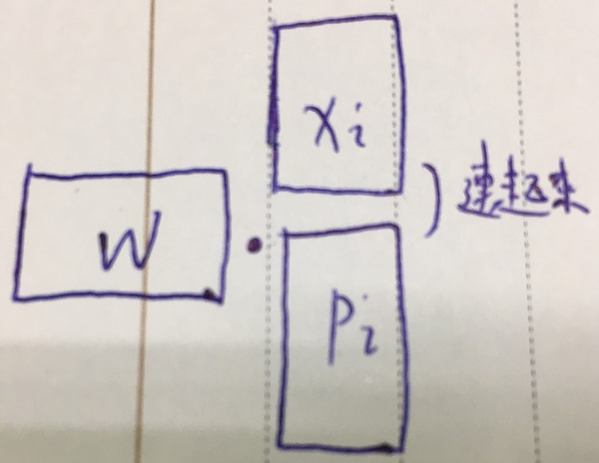

這樣一看起來就好理解很多，又回到了 Model 的概念。然後我們把 __W__ 做分割，如下 : 

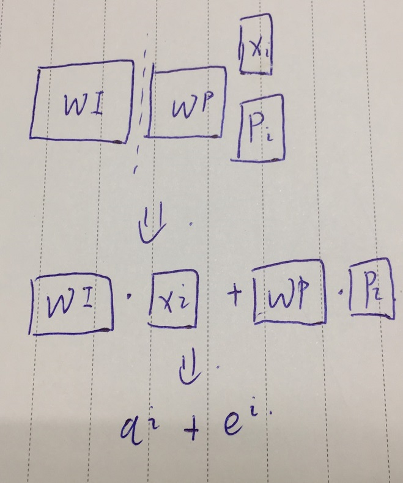

<br>

ps : Hung-yi Lee 老師影片上是說 `Wi*Xi + Wp*Pi`，但是參考原文作者堆於這邊的處理似乎並沒有對輸入資料的詞向量 Xi 做與 W 的點積運算，而是拿詞向量直接與 position vector 相加了。

這一段 code 先不用實做，看看就好。這邊只是拿其中一段舉例。
```py
x = self.embedding(x) # 詞序列先變詞向量
x *= tf.math.sqrt(tf.cast(self.d_model, tf.float32))  # paper 上說要這樣做，可能這邊就是在做 Wi*Xi，個人猜測。
x += self.pos_encoding[:, :input_seq_len, :]  # 加入位置 encoding
```

當然，這邊不理解也沒影響，畢竟 Tensorflow 已經給出 func 了，直接用也可以。


<br>
<br>

---

<br>
<br>

## 五丶Encoder 與 Decoder

<br>

終於來到最核心的部分了，這是整個機器翻譯的最大重點，Encoder 與 Decoder。

檢視一下我們的任務需求，其實就是輸入一段序列(英文)，得到另一串序列(中文)。為了應對這種 __序列生成問題__，我們可以使用 RNN 架構解決問題，也叫做  __Sequence to Sequence Model__。

先來看一張圖 : 

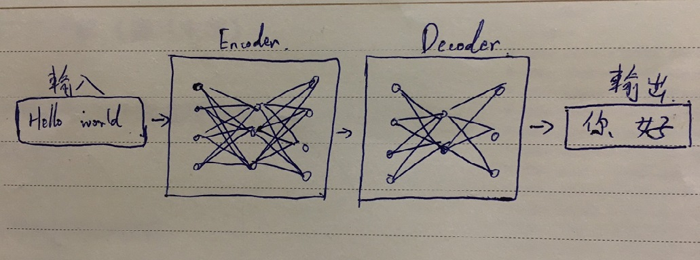

簡單看起來 seq2seq Model 就是這樣。

<br>

讓我們再細分一下，他裡面到底都 做了甚麼 : 

<br>

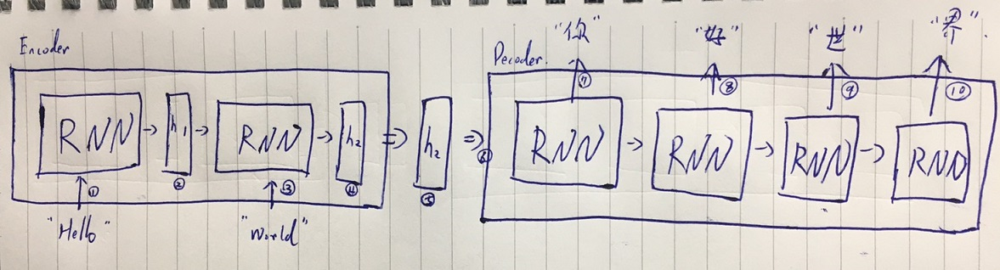

首先，Encoder 先吃進去 "Hello" 給到第一個 RNN，然後生成一個 hidden_state_1，然後把 hidden_state_1 與 "world" 給到第二個 RNN 中產出 hidden_state_2。

我們拿到的 hidden_state_2 代表 Encoder 已經看完整個句子的結果。把它送入 Decoder 後就可以解析出目標句子。

這樣做有一些缺點，比如我們有一個很長的句子，不可能在有限空間內用一個 hidden_state 表達完整句意。並且這樣不能進行平行化運算。所以大神們就有了新的 idea，就是 __注意力機制（Attention Mechanism）__，提供更多資訊給 Decoder，並透過類似資料庫存取的概念，令其自行學會該怎麼提取資訊。(關於平行化運算會在第六單元講解)

<br>

來看一下加入注意力機制的 Seq2Seq Model 吧 : 

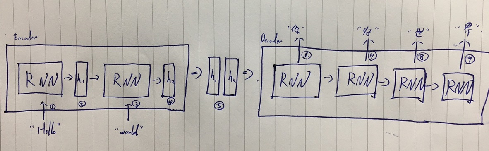

其實乍一看好像沒變化，但是注意一下第 5 步，這次我們一口氣把每一個 hidden_state 都丟給 Decoder 讓 Decoder 自己決定要怎麼去使用 hidden_state 的資訊。

Decoder 在做翻譯的動作時，會對目前所進行翻譯位址進行考量，究竟該把哪一個 hidden_state 看的重一點哪一個輕一點。

(ps: 這邊舉個例子，我們英翻中的時候，翻譯順序基本上可以正常的從前往後，翻中文時，越靠前的英文單字我們注意權重越高，越後面的權重越低。但是如果今天是日翻中，因為日文中都把動詞方到一句話最後，所以翻譯中文時，當翻譯到動詞那一塊可能需要先把注意權重調到日文原句後面才行。)

<br>

其實上面講的這些都簡化太多了，這邊有一張 Tensorflow 官方給出的原圖，說明 __seq2seq + 注意力機制__ 的圖示 : 

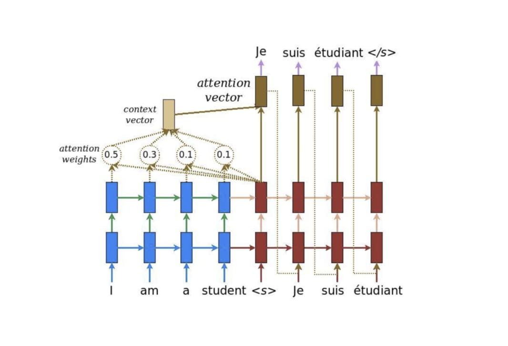

圖片來源 : https://leemeng.tw/images/transformer/attention_mechanism_luong.jpg

說實話，這張圖在我一開始研究深度學習的時候搞了一個月都沒看懂。不過實作過數次之後就清楚很多了，那這邊就藉著這張圖來說一說到底它在忙些甚麼吧 ! 

首先我們看到左半邊(藍色部分) 這半邊是 Encoder 的範圍，這邊在做的事情跟前面提到的一樣，就是在一層一層傳遞生成 hidden_state，也就是圖片中紅框部分。

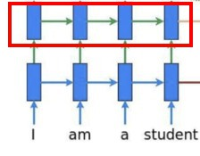

<br>

當 hidden 生成好後，我們先丟給 Decoder 一個 __\<S\>__ (BOS)


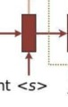

給了 Decoder 這個 BOS 就相當於告訴它，我們要接下來產出第一個字拉 ! 於是乎我們的 Decoder 產出第一個字 __Je__ 時，不僅又參考了前一個 input __BOS__ 也參考了 Encoder 給出的 hidden_state，並且是根據權重計算喔 :

產第一個字時的權重　：


所以這邊再次強調一下，我們產生第一個字 Je 時，__Decoder__ 是看了前一個字 __"\<S\>"__ 與 __Encoder__ 輸出串列乘上權重才下的判斷。 

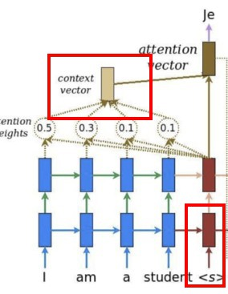

<br>

那產生完第一個字 Je 之後呢，接下來要做的步驟跟先前一模一樣，再生長第二個字時，我們除了要看 Enocder 的 output 之外，還要去看前面已經生成好的句字，如下 : 

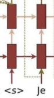

得到輸入為 ["\<S\>", "Je"]，同時看到 Encoder 的結果，我們的 Decoder 就可以生成下一個字 "suis": 

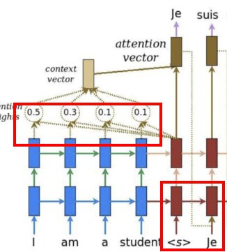

這樣依次類推，最終結果就會是 : 

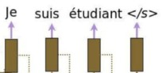

<br>

再強調說明幾個重點，在訓練還沒開始前，這些權重都是隨機且無意義的。是透過訓練，神經網路才知道該為這些權重賦予什麼值。

這邊觀念很重要喔，一定要弄懂。

<br>
<br>

---

<br>
<br>

## 六丶自注意力機制

前面提到了 seq2seq 的一個弱點是無法平行化運算，假如我們要轉化一個句子，那生成整個序列時就必須要看完整個句子才能算出結果，白話意思就是後一個序列依賴前一個的結果，後面不斷依賴前面，所以就會發生等待問題。

self-attentaion 就是解決這樣的問題而誕生的方法。

先提供最完整的教學資源 [Transformer by Hung-yi Lee](https://www.youtube.com/watch?v=ugWDIIOHtPA)

self-attention 的計算公式我這邊就不再重複講了，影片中提到的公式待會會實作一次，在這之前，讓我手畫一張圖來說明一下加入 self-attention 之後的架構 : 

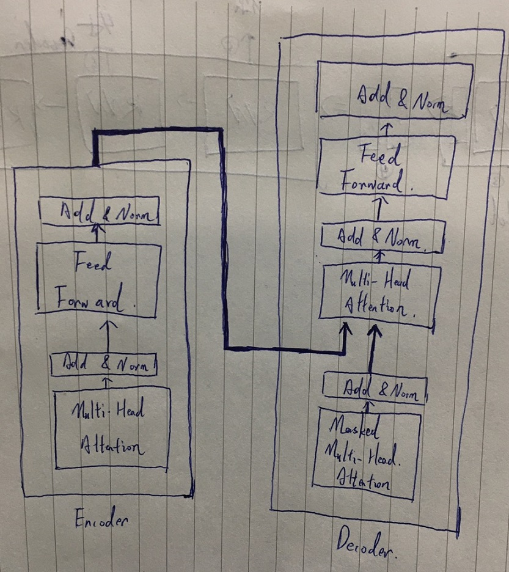

這張圖在老師影片中有出現過，如果還是無法理解這些都是甚麼的話，沒關係，繼續看下去。

我們看整體架構，我會在這張圖上劃分 3 個部分 : 


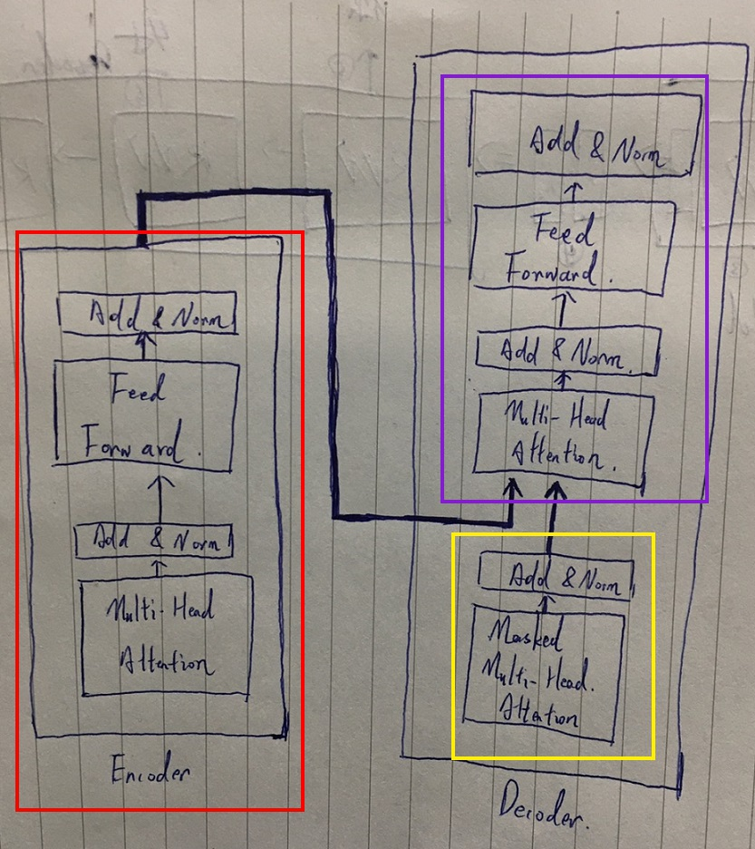

我們前面第 5 單元提到 seq2seq + Attention 機制的架構，其實道理都是一樣，紅色 Encoder 部分先算出來源語言的 vector，然後黃色部份吃進來目標語言的 "前一個字"(假如是 \<S\>)，然後一併把紅丶黃的運算結果合併送給紫色部份做運算，其實可以看到紅色跟紫色的結構是一樣的。

所以現在理解起來下面這個短片應該已經不是甚麼難事了吧，直接點開連結來看，特別要注意，這個影片中 Encoder 與 Decoder 分別各有 3 層 : 


https://leemeng.tw/images/transformer/transformer-nmt-encode-decode.mp4

看不懂多看幾遍，多想一下，其實沒有很複雜。


<br>
<br>

看熟影片之後，接下來就要進實作了。

<br>
<br>

## 6-1 遮罩

Decoder 在推算目標序列時，需要有遮罩的幫忙。甚麼是遮罩呢 ? 顧名思義就是讓他不要看到他不該看的東西。

這邊先介紹 2 種 mask : 

* padding mask  （把 padding 遮住，讓 decoder 忽略 padding 部份）

* look ahead mask　（在 Decoder 推算接下來的一個字詞時，只能看到前面已經推算出來的結果）

<br>

### padding mask : 

目的是讓 Model 不要去關注到 padding。

```py
def create_padding_mask(seq):
  # padding mask 的工作就是把索引序列中為 0 的位置設為 1
  mask = tf.cast(tf.equal(seq, 0), tf.float32)
  return mask[:, tf.newaxis, tf.newaxis, :] #　broadcasting

inp_mask = create_padding_mask(inp)
print(inp_mask)
```

輸出 : 

```bash
<tf.Tensor: id=193029, shape=(2, 1, 1, 8), dtype=float32, numpy=
array([[[[0., 0., 0., 0., 0., 0., 1., 1.]]],
       [[[0., 0., 0., 0., 0., 0., 0., 0.]]]], dtype=float32)>
```

_看一下，這個 Mask Tensor 的 shape 是 4 維的，4 維的目的一是為了做 broadcasting 運算，二是為了 __"多頭機制"__。關於多頭機制會在下面一節說明，這邊先不要太過於糾結為甚麼多了二維。_

拿這個 mask 跟 原本的那一句話做比對 : 

    mask = [
        [0., 0., 0., 0., 0., 0., 1., 1.],
        [0., 0., 0., 0., 0., 0., 0., 0.]
    ]

    seq = [
        [8135,  105,   10, 1304, 7925, 8136,    0,    0],
        [8135,   17, 3905, 6013,   12, 2572, 7925, 8136]
    ]

這樣一筆對就很清楚可以看到，padding 的 0 對應到 mask 的 1，其他都是 0，在往後的運算時，我們會讓 mask 乘上一個很大的負數，mask 就會變成以下這樣 : 


    mask = [
        [0., 0., 0., 0., 0., 0., -max., -max.],
        [0., 0., 0., 0., 0., 0., 0., 0.]
    ]

然後 mask 與 seq 相加，原本的欄位不變，padding 變無限大，新的 seq 如下 : 

    new_seq = [
            [8135, 105, 10, 1304, 7925, 8136, -max, -max],
            [8135, 17, 3905, 6013, 12, 2572, 7925, 8136]
        ]

這樣的資料再進去 Model 做運算，當 Model 裡面輸出端用 'relu' 做激勵函數時，會把結果為負的值變 0。'relu' 激勵函數可以理解為 `max(seq, 0)`，白話意思就是把負數變 0。

<br>
<br>

### look ahead mask：

目的是要確保 Decoder 在進行自注意力機制時輸出序列的每個子詞只會關注到自己之前（左邊）的字詞，不會不小心關注到未來（右邊）還沒被 Decoder 生成的子詞。

```py
# 建立一個 2 維矩陣，維度為 (size, size)，
def create_look_ahead_mask(size):
  mask = 1 - tf.linalg.band_part(tf.ones((size, size)), -1, 0)
  return mask  # (seq_len, seq_len)
```


<br>

關於 `tf.linalg.band_part()` 使用方法，請參考這一篇筆記[（點這裡！）](https://nbviewer.jupyter.org/github/Johnny1110/Deep_Learning_Note/blob/master/basic_tool_use/tf.linalg.band_part%28%29%EF%BC%8C%E4%B8%8A%E4%B8%8B%E4%B8%89%E8%A7%92%E5%BD%A2.ipynb)

<br>

我們先建立一個 mask 來看看 : 

```py
seq_len = emb_tar.shape[1] # 注意這次我們用中文的詞嵌入張量 `emb_tar`
look_ahead_mask = create_look_ahead_mask(seq_len)
print("emb_tar:", emb_tar)
print("-" * 20)
print("look_ahead_mask", look_ahead_mask)
```

輸出 :

```py
emb_tar: tf.Tensor(
[[[-0.0441955  -0.01026772  0.03740635  0.02017349]
  [ 0.02129837 -0.00746276  0.03881821 -0.01586295]
  [-0.01179456  0.02825376  0.00738146  0.02963744]
  [ 0.01171205  0.04350302 -0.01190796  0.02526634]
  [ 0.03814722 -0.03364048 -0.03744673  0.04369817]
  [ 0.0280853   0.01269842  0.04268574 -0.04069148]
  [ 0.04029209 -0.00619308 -0.04934603  0.02242902]
  [-0.00285894  0.02392108 -0.03126474  0.01345349]
  [-0.00285894  0.02392108 -0.03126474  0.01345349]
  [-0.00285894  0.02392108 -0.03126474  0.01345349]]

 [[-0.0441955  -0.01026772  0.03740635  0.02017349]
  [-0.00359621 -0.01380367 -0.02875998 -0.03855735]
  [ 0.04516688 -0.04480755 -0.03278694 -0.0093614 ]
  [ 0.04131394 -0.04065727 -0.04330624 -0.03341667]
  [ 0.03572228 -0.04500845  0.0470326   0.03095007]
  [-0.03566641 -0.03730996 -0.00597564 -0.03933349]
  [ 0.01850356  0.03993076  0.02729526 -0.04848848]
  [-0.02294568 -0.02494572 -0.0136737  -0.04278342]
  [ 0.0280853   0.01269842  0.04268574 -0.04069148]
  [ 0.04029209 -0.00619308 -0.04934603  0.02242902]]], shape=(2, 10, 4), dtype=float32)
--------------------------------------------------------------
look_ahead_mask tf.Tensor(
[[0. 1. 1. 1. 1. 1. 1. 1. 1. 1.]
 [0. 0. 1. 1. 1. 1. 1. 1. 1. 1.]
 [0. 0. 0. 1. 1. 1. 1. 1. 1. 1.]
 [0. 0. 0. 0. 1. 1. 1. 1. 1. 1.]
 [0. 0. 0. 0. 0. 1. 1. 1. 1. 1.]
 [0. 0. 0. 0. 0. 0. 1. 1. 1. 1.]
 [0. 0. 0. 0. 0. 0. 0. 1. 1. 1.]
 [0. 0. 0. 0. 0. 0. 0. 0. 1. 1.]
 [0. 0. 0. 0. 0. 0. 0. 0. 0. 1.]
 [0. 0. 0. 0. 0. 0. 0. 0. 0. 0.]], shape=(10, 10), dtype=float32)
```

這邊我們著重看 `look_ahead_mask` 就好。前面說到了 `padding_mask` 會把出現 1 的部分全部乘上一個很大的負數，加入到 `attention_weight` 中，目的是把 Weight 中不該注意的地方變 "0"。 `look_ahead_mask` 也是一樣，聰明的你應該一看就知道 `look_ahead_mask` 長成這樣代表甚麼意思，但我還是再多寫幾行來說明好了。

```py
look_ahead_mask tf.Tensor(
[[0. 1. 1. 1. 1. 1. 1. 1. 1. 1.]  # Decoder 翻第一個字時，權重只注意自己就好了
 [0. 0. 1. 1. 1. 1. 1. 1. 1. 1.]  # Decoder 翻第二個字時，權重要注意自己與前一個字
 [0. 0. 0. 1. 1. 1. 1. 1. 1. 1.]  # ... 依次類推 ...
 [0. 0. 0. 0. 1. 1. 1. 1. 1. 1.]
 [0. 0. 0. 0. 0. 1. 1. 1. 1. 1.]
 [0. 0. 0. 0. 0. 0. 1. 1. 1. 1.]
 [0. 0. 0. 0. 0. 0. 0. 1. 1. 1.]
 [0. 0. 0. 0. 0. 0. 0. 0. 1. 1.]
 [0. 0. 0. 0. 0. 0. 0. 0. 0. 1.]
 [0. 0. 0. 0. 0. 0. 0. 0. 0. 0.]], shape=(10, 10), dtype=float32)
```

<br>
<br>
<br>
<br>

## 6-2 Scaled dot product attention

<br>

老師的教學影片中提到 : 

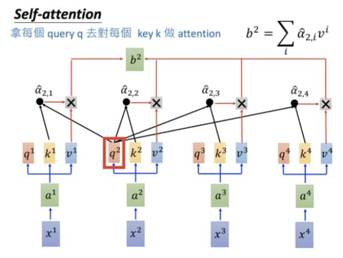

這個進算過程必須要理解，因為待會要時做這個部份。

最核心的部份，其實就是這個公式 : 


<br>

我們前面已經準備好英文詞向量 emb_inp，我們的就用 emb_inp 當作 __q__ 跟 __k__。__v__ 就用一個隨機產生的 binary 張量。

```py
# 設定一個 seed 確保我們每次都拿到一樣的隨機結果
tf.random.set_seed(9527)

# 自注意力機制：查詢 `q` 跟鍵值 `k` 都是 `emb_inp`
q = emb_inp
k = emb_inp
# 簡單產生一個跟 `emb_inp` 同樣 shape 的 binary vector
v = tf.cast(tf.math.greater(tf.random.uniform(shape=emb_inp.shape), 0.5), tf.float32)
v
```

v 的輸出 : 

```py
<tf.Tensor: id=193043, shape=(2, 8, 4), dtype=float32, numpy=
array([[[1., 0., 0., 0.],
        [0., 1., 0., 1.],
        [0., 0., 0., 1.],
        [1., 0., 1., 0.],
        [1., 0., 1., 0.],
        [0., 1., 0., 1.],
        [0., 0., 1., 0.],
        [0., 1., 0., 1.]],

       [[1., 0., 1., 1.],
        [1., 0., 1., 0.],
        [1., 0., 0., 0.],
        [1., 0., 1., 0.],
        [0., 1., 0., 1.],
        [1., 1., 1., 1.],
        [0., 0., 0., 0.],
        [0., 0., 1., 0.]]], dtype=float32)>
```

__q, k, v__ 以圖示展現出來效果 : 

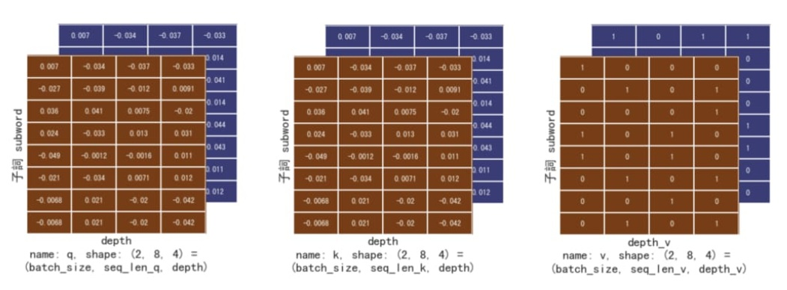

<br>
<br>

---

<br>

這邊待會要涉及到 dot product 概念，需要高中矩陣乘法知識，如果忘記了，請點這邊複習一下 : 

* [dot product 基礎](dot_product.md)

<br>

---

scaled dot product attention 在 TensorFlow 裡的實作：

```py
def scaled_dot_product_attention(q, k, v, mask):
  """計算注意權重.
  mask 可以根據不同的 mask 型態有不同的 shape (padding or look ahead)，
  但必須具有 broadcasting 特性.
  
  Args:
    q: query shape == (..., seq_len_q, depth)
    k: key shape == (..., seq_len_k, depth)
    v: value shape == (..., seq_len_v, depth_v)
    mask: Float tensor with shape broadcastable 
          to (..., seq_len_q, seq_len_k). Defaults to None.
    
  Returns:
    output, attention_weights
  """
  # 將 `q`、 `k` 做點積再 scale，(transpose_b=True 意思是讓第二個參數 k 先轉置)
  # 轉置後相乘我想不必多說，就是 dot product 的觀念。
  matmul_qk = tf.matmul(q, k, transpose_b=True)  # (..., seq_len_q, seq_len_k)
  
  dk = tf.cast(tf.shape(k)[-1], tf.float32)  # 取得 seq_k 的序列長度
  scaled_attention_logits = matmul_qk / tf.math.sqrt(dk)  # scale by sqrt(dk)

  # 將遮罩「加」到被丟入 softmax 前的 logits
  if mask is not None:
    # 經過此步之後，scaled_attention_logits 的 padding 部分會變成一個很大的負數
    scaled_attention_logits += (mask * -1e9) 

  # 取 softmax 是為了得到總和為 1 的比例之後對 `v` 做加權平均
  attention_weights = tf.nn.softmax(scaled_attention_logits, axis=-1)  # (..., seq_len_q, seq_len_k)
  
  # 以注意權重對 v 做加權平均（weighted average）
  output = tf.matmul(attention_weights, v)  # (..., seq_len_q, depth_v)

  return output, attention_weights
  ```

  這邊要注意的是 __attention_weights__，注意一下 shape 格式 （sample_num, seq_len_q, seq_len_k），甚麼意思呢，我們從最後一個維度來看，最後一個維度是 __seq 長度__，這代表說這邊存放的資料是目前生產這個詞時需要考量整句的權重。我們先看一下實際資料 : 

```py 
output: tf.Tensor(
[[[0.37502408 0.37503672 0.37488326 0.49993956]
  [0.37513658 0.37514552 0.37500778 0.49994028]
  [0.37483314 0.37482613 0.3749625  0.50006175]
  [0.37516367 0.37501514 0.3750258  0.49997073]
  [0.37503195 0.3751256  0.3750621  0.49998796]
  [0.37512696 0.37512186 0.37502852 0.49996266]
  [0.3748441  0.3749599  0.37492597 0.50001484]
  [0.3748441  0.3749599  0.37492597 0.50001484]]

 [[0.62516296 0.2500847  0.6250717  0.37522966]
  [0.62490153 0.24994145 0.62504375 0.37497035]
  [0.62509674 0.2501282  0.6249581  0.37518966]
  [0.62518024 0.25003165 0.6250133  0.37507355]
  [0.6250232  0.25011832 0.62486345 0.37516582]
  [0.6251376  0.25018096 0.625095   0.37525034]
  [0.62478966 0.24995528 0.6248975  0.37490302]
  [0.62492853 0.24997747 0.62507135 0.37497336]]], shape=(2, 8, 4), dtype=float32)
--------------------------------------------------------------------
attention_weights: tf.Tensor(
[[[0.12517719 0.12502946 0.12490283 0.12493535 0.12491155 0.12497091
   0.12503636 0.12503636]
  [0.12505189 0.12512855 0.12479477 0.1250193  0.12506542 0.12509388
   0.12492308 0.12492308]
  [0.12497574 0.12484524 0.1252356  0.12496044 0.12489695 0.1248758
   0.12510511 0.12510511]
  [0.12500346 0.12506503 0.1249556  0.12519364 0.12496658 0.12508455
   0.12486558 0.12486558]
  [0.12494988 0.12508136 0.12486238 0.12493681 0.12514524 0.12506418
   0.12498005 0.12498005]
  [0.12500885 0.12510943 0.12484082 0.12505434 0.12506378 0.12510203
   0.12491038 0.12491038]
  [0.1250592  0.12492351 0.12505497 0.12482036 0.12496454 0.12489527
   0.12514108 0.12514108]
  [0.1250592  0.12492351 0.12505497 0.12482036 0.12496454 0.12489527
   0.12514108 0.12514108]]

 [[0.12514497 0.1249882  0.12503006 0.12493392 0.1250188  0.12506588
   0.1248794  0.12493874]
  [0.1250289  0.12513264 0.12493595 0.12481083 0.12494826 0.12499319
   0.12507208 0.12507817]
  [0.12506142 0.12492662 0.12505917 0.12498691 0.12506557 0.12506266
   0.12491715 0.12492047]
  [0.12504192 0.12487808 0.1250636  0.12521076 0.12504579 0.12498584
   0.12487733 0.12489669]
  [0.12504749 0.12493626 0.12506288 0.12496644 0.12510824 0.12501009
   0.12496544 0.12490314]
  [0.12506938 0.12495602 0.1250348  0.12488137 0.12498492 0.12519602
   0.12488527 0.12499221]
  [0.12494776 0.12509981 0.1249542  0.12483776 0.12500516 0.12495013
   0.12514311 0.12506206]
  [0.12499588 0.12509465 0.12494626 0.12484587 0.1249316  0.12504588
   0.12505081 0.12508905]]], shape=(2, 8, 8), dtype=float32)
```
我們取出 attention_weights的資料 [0, 0, :] 也就是第一筆 : 

```
[0.12517719 0.12502946 0.12490283 0.12493535 0.12491155 0.12497091 0.12503636 0.12503636]
```

這個是甚麼意思呢 ? 就是再計算 output 第一個字時，分別需要參考本句其他字詞的比重，因為我們這個 Model 還沒有訓練，所以現在看起來權重似乎都一樣，不過等開始訓練之後，這個第一個字的權重就會慢慢變得合理化。或許會變成這樣 : 

```py
[0.8010000 0.12502946 0.091000 0. 0. 0. 0. 0.]  # 預估結果
```
<br>


這邊再整理強調一下以上這些實現公式的步驟 ：

1. q, k 做 [點積運算](dot_product.md)（不是矩陣乘法），得到的張量結果 `shape = (..., seq_len_q, seq_len_k)`

2. 將以上結果除以開根號的 dk，dk 代表 k 序列長度。

3. 將遮罩乘上 `-1e9` 之後加到上面結果中，其目的是在此處把應該要被忽略不計的值通通變成一個很大的負數。

4. 將以上結果送入 softmax 函式中，求出加權值。__（注意 ! 做到這一步我們已經成功求出了注意力權重了，並且上面第 3 步被遮罩助理過的負數將統統變 0）__

5. 最後就是拿 權重 * V 得到最終 output。

<br>
<br>
<br>
<br>


## 6-3 Multi-head attention

<br>

Multi-head attention 多頭注意力機制。老師在影片中有提到說 Multi-head attention
的作用在於可以讓 Model 在計算時分別去注意一些特別的東西。痾....

具體有哪些特別我還真不知道，實做過後看來，不過就是把詞向量拆分開運算，最後在合併起來而已。例如原本 4 維度的詞向量，我們拆 2 份就變成分別計算兩個 2 維向量。就這樣而已。部落格原文的 LeeMeng 老師也有給出他的解釋，以下引用老師的說法 :

<br>

>_"為何要那麼「搞剛」把本來 d_model 維的空間投影到多個維度較小的子空間（subspace）以後才各自進行注意力機制呢？這是因為這給予模型更大的彈性，讓它可以同時關注不同位置的子詞在不同子空間下的 representation，而不只是本來 d_model 維度下的一個 representation。"_

<br>

OK，聽起來好像還好，再來看看這一張圖 : 

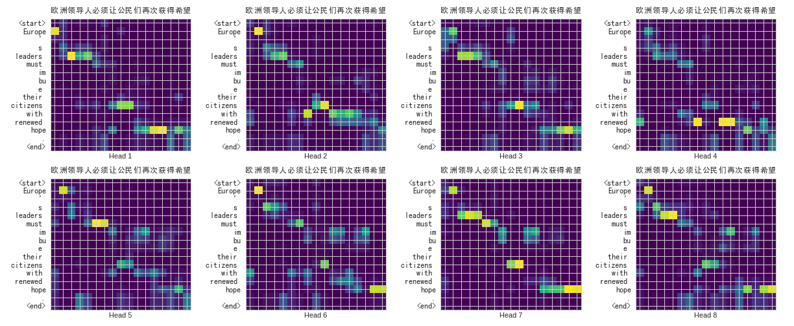

這邊同一段翻譯，Model 一共切了 8 個 Head 做運算，可以很清楚的看到每一個 Head 看到的權重都不一樣。感覺像是 8 個大腦同步運算。透過這樣同時關注多個不同子空間裡頭的子詞的 representation，Transformer 最終可以生成更好的結果。

<br>

實現 Multi-head attention : 

首先在實作前要先了解一點，我們切幾個頭不是想切多少就切多少，我們要考量以下 3 點。

1. 詞向量大小一定要可以被頭的數量整除，這點應該不用多說，今天詞向量有 4 維，總不能說切三份來玩吧，4 維詞向量我們只能切 2 或 4 份。

2. 機器效能。當機器不夠力，頭切的又多。這樣不是只會造成運算緩慢而以，還會造成爆記憶體。 2020 年買的一塊 GeForce RTX 2070 顯卡可以跑大概 8 頭，當然也其他參數之間互相制衡，這些都依實際情況做決定。

3. 實際模型準確度。頭的數量其實是一個可調整的超參數，可長可短，有些時候頭太多反而效果變差，需要實際實驗找到最合適的數值。

<br>

定義切頭方法 : 

```py

def split_heads(x, d_model, num_heads):
    """
    split_heads 可以切割原本的張量資料變成 num_heads 個。

    args:
        x        : 輸入的張量 x.shape = (batch_size, seq_len, d_model)
        d_model  : 詞向量大小
        num_heads: 頭的數量
    """

  batch_size = tf.shape(x)[0]

  # 我們要確保維度 `d_model` 可以被平分成 `num_heads` 個 `depth` 維度
  assert d_model % num_heads == 0
  depth = d_model // num_heads  # 分成多頭後每個向量的新維度大小

  # 將最後一個 d_model 維度分成 num_heads 個 depth 維度。
  # 最後一個維度變成兩個維度，張量 x 從 3 維到 4 維
  # (batch_size, seq_len, num_heads, depth)
  reshaped_x = tf.reshape(x, shape=(batch_size, -1, num_heads, depth)) 

  # 將 head 的維度拉前使得最後兩個維度為子詞以及其對應的 depth 向量
  # (batch_size, num_heads, seq_len, depth)
  output = tf.transpose(reshaped_x, perm=[0, 2, 1, 3])
```

關於 `reshape` 與 `transpose`，不了解的可以看 [__這裡__](https://nbviewer.jupyter.org/github/Johnny1110/Deep_Learning_Note/blob/master/basic_tool_use/%E5%BC%B5%E9%87%8F%E9%87%8D%E5%A1%91%20%28%20reshape%20%29.ipynb)，如果不想實在不想了解這段 code 到底做了甚麼，也沒關係，你只要知道 input 跟 output 是甚麼就好，向下面這樣 :

```py
x.shape = (batch_size, seq_len, d_model) = (2, 8, 4)
num_heads = 2
depth = d_model // num_heads = 2

output.shape = (batch_size, num_heads, seq_len, depth) = (2, 2, 8, 2) 

# 有一定經驗的人從 (2, 2, 8, 2) 應該一眼就看的出來現在資料被  reshape 後的樣子
# 再次說明一下 : 這批資料一共有 2 筆句子，每一筆句子被分成 2 個"頭"，每個頭有 8 個 seq 長度，每個 seq 有兩個維度。
```

<br>
<br>

切頭工作做完了，接下來該做的就是包裝一下 class 了:

```py
# 實作一個執行多頭注意力機制的 keras layer
class MultiHeadAttention(tf.keras.layers.Layer):

    # 初始化，建立參數 d_model(詞向量深度)，nm_heads(頭的數量)。
    def __init__(self, d_model, num_heads):
        super(MultiHeadAttention, self).__init__()
        self.num_heads = num_heads
        self.d_model = d_model

        # 驗證 d_model 是否可以被 num_heads 整除
        assert d_model % self.num_heads == 0  
        # 每個頭的新詞向量深度
        self.depth = d_model // self.num_heads  
        
        # 提供的 q k v 三個參數的線性轉換。
        self.wq = tf.keras.layers.Dense(d_model)  
        self.wk = tf.keras.layers.Dense(d_model)
        self.wv = tf.keras.layers.Dense(d_model)
        
        # 多個 heads 串接之後通過的一次線性轉換
        self.dense = tf.keras.layers.Dense(d_model)
  
    # 這個就是包裝過後的切頭公式
    def split_heads(self, x, batch_size):
        """把 x 最後一維切割成 (num_heads, depth).
        傳置加重塑後 x 變這樣: (batch_size, num_heads, seq_len, depth)
        """
        x = tf.reshape(x, (batch_size, -1, self.num_heads, self.depth))
        return tf.transpose(x, perm=[0, 2, 1, 3])
  
    # 定義這個方法之後主程式宣告完 class 之後就可以直接用呼叫了，這個晚一點會說明。
    def __call__(self, v, k, q, mask):
        batch_size = tf.shape(q)[0]
        
        # 把 q k v 必須都分別做一次線性轉換，老師的影片裡面有說明 q*w, k*w, v*w。
        # w 是 AI 可以學習出來的
        q = self.wq(q)  # (batch_size, seq_len, d_model)
        k = self.wk(k)  # (batch_size, seq_len, d_model)
        v = self.wv(v)  # (batch_size, seq_len, d_model)
        
        # q, k, v 分別切頭
        q = self.split_heads(q, batch_size)  # (batch_size, num_heads, seq_len_q, depth)
        k = self.split_heads(k, batch_size)  # (batch_size, num_heads, seq_len_k, depth)
        v = self.split_heads(v, batch_size)  # (batch_size, num_heads, seq_len_v, depth)
        
        # 我們前面有實作一個 self-attention 的 func，這個時候就賣上用場了。
        # 利用 broadcasting 讓每個句子的每個 head 的 qi, ki, vi 都各自進行注意力機制。
        # 還記得前面 padding 產出的 shape 嗎? 一樣是四維的，就是為了呼應這邊切的多頭機制。
        scaled_attention, attention_weights = scaled_dot_product_attention(
            q, k, v, mask)
        # scaled_attention.shape == (batch_size, num_heads, seq_len_q, depth)
        # attention_weights.shape == (batch_size, num_heads, seq_len_q, seq_len_k)
        
        # 多頭算完之後記得要合併回來呀 ! 很重要!先 Transpose， seq 又變回第二維度了。
        scaled_attention = tf.transpose(scaled_attention, perm=[0, 2, 1, 3])
        concat_attention = tf.reshape(scaled_attention, 
                                    (batch_size, -1, self.d_model)) 


        # 合併好後通過最後一個線性轉換
        output = self.dense(concat_attention)  # (batch_size, seq_len_q, d_model)
        
        return output, attention_weights
```

<br>

定義好 class 後可以來實際測試一下 :


```py
# emb_inp.shape == (batch_size, seq_len, d_model)
#               == (2, 8, 4)
assert d_model == emb_inp.shape[-1]  == 4  # 實際上 d_model 不一定是 4，只是為了方便測試所以這邊寫死
num_heads = 2  # 再次提醒，num_heads 必須要可以整除 d_model

print(f"d_model: {d_model}")
print(f"num_heads: {num_heads}\n")

# 初始化一個 multi-head attention layer
mha = MultiHeadAttention(d_model, num_heads)

# q, k, v 都設定維 emb_inp。
v = k = q = emb_inp
padding_mask = create_padding_mask(inp)
print("q.shape: ", q.shape)
print("k.shape: ", k.shape)
print("v.shape: ", v.shape)
print("padding_mask.shape: ", padding_mask.shape)  # 注意這邊 mask 是一個 4 維張量。
```

輸出 : 

```py
d_model: 4
num_heads: 2

q.shape: (2, 8, 4)
k.shape: (2, 8, 4)
v.shape: (2, 8, 4)
padding_mask.shape: (2, 1, 1, 8)  # 四維喔 ! 
```
<br>
<br>

產生計算結果 : 

```py
output, attention_weights = mha(v, k, q, mask)
print("output.shape: ", output.shape)
# attention_weights.shape 仍然保有多頭的樣子
print("attention_weights.shape: ", attention_weights.shape)  
print("---"*20)
print("---"*20)
print("output: ", output)
```

輸出 : 

```py
output.shape: (2, 8, 4)
attention_weights.shape: (2, 2, 8, 8)
---------------------------------------------------------
---------------------------------------------------------
output: tf.Tensor(
[[[ 0.00862424  0.00463534  0.00123856  0.01982255]
  [ 0.00860434  0.00464583  0.00125165  0.01984711]
  [ 0.00863869  0.00461318  0.00122942  0.01981261]
  [ 0.00858585  0.00465442  0.00125683  0.0198578 ]
  [ 0.0086211   0.00462923  0.0012448   0.01983759]
  [ 0.00860078  0.00464716  0.00125472  0.01985404]
  [ 0.00865074  0.00461071  0.00122681  0.01980557]
  [ 0.00865074  0.00461071  0.00122681  0.01980557]]

 [[-0.00233657  0.02963993  0.01171194  0.03959805]
  [-0.00234752  0.02964369  0.01171828  0.03960991]
  [-0.00232748  0.02962957  0.01170804  0.03959192]
  [-0.00233163  0.02963142  0.0117076   0.03959151]
  [-0.00231678  0.02962143  0.01170276  0.03957902]
  [-0.00234718  0.02964409  0.01171941  0.03961902]
  [-0.00233476  0.029631    0.01171241  0.03959794]
  [-0.00235306  0.02964601  0.01172148  0.03961948]]], shape=(2, 8, 4), dtype=float32)
```

前面在講 padding_mask 的時候不是說先不討論為甚麼是一個 4 維張量嗎，而不是一個三維 output，多出來的一維其實就是為了這邊可以跟切了 __"多頭"__ 的資料做 broadcasting。


<br>

----

如果對 Multi-Head-Attention 運算過程還是不太了解，可以看一下 LeeMeng 老師部落格提供的影片，會比較好理解 -> [連結](https://leemeng.tw/images/transformer/multi-head-attention.mp4)

---

<br>
<br>
<br>
<br>

## 七丶打造 Encoder 與 Decoder

<br>

前面一個章節有看到一個架構圖，這邊重新拿出來審視一下 : 


接下來就是一步一步打造它們拉 ! 

<br>
<br>

## 7-1 FFN (Feed-Forward Networks)

架構圖中可以看到有一個部分 : 


### 先說明一下這一層存在的意義 : __FFN 可以從輸入的 d_model 維度裡頭擷取一些有用的資訊__

<br>

直接看 code 最快 : 

```py
# 建立 Transformer 裡 Encoder / Decoder layer 都有使用到的 Feed Forward 元件
def point_wise_feed_forward_network(d_model, dff):
  
  # 此 Model 對輸入做兩次線性轉換，中間加了一個 ReLU activation func
  return tf.keras.Sequential([
      tf.keras.layers.Dense(dff, activation='relu'),  # (batch_size, seq_len, dff)
      tf.keras.layers.Dense(d_model)  # (batch_size, seq_len, d_model)
  ])
```

輸入跟輸出前後格式是一樣的，直白一點可以理解為我們把算出來的結果丟進去這個 Model 讓他 __"攪一攪"__。然後返給我們的輸出格式不能跑掉，但結果值會更加 __"有用"__。

還是要稍微專業化一點解釋比較好，其實也不難，這個 Model 在做的事情分以下幾步 :

* 輸入資料 `(batch_size, seq_len, d_model)`

* 經過第一個神經層做一次線性轉換，原本 `d_model` 維度，傳換成 `dff` 維度，並套用 relu 方法。本層的輸出會是 `(batch_size, seq_len, dff)`

    relu 有必要解釋一下，他其實就是一個方法 `max(x, 0)`。把所有負的值變 0，其他正值保留。

* 最後一層再一次線性轉換把值轉回跟輸入時一樣的 shape `(batch_size, seq_len, d_model)`

<br>

### 還有一點 : 論文上的 `dff` 設為 2048， `d_model` 為 521，剛好是四倍，所以在訓練自己的 Model 時，盡量也比照論文 4 : 1 辦理。

<br>
<br>

實際測試一個 FFN :

```py
batch_size = 64
seq_len = 10
d_model = 512
dff = 2048

x = tf.random.uniform((batch_size, seq_len, d_model))
ffn = point_wise_feed_forward_network(d_model, dff)
out = ffn(x)
print("x.shape:", x.shape)
print("out.shape:", out.shape)
```

輸出 : 

```py
x.shape: (64, 10, 512)  # (批次, 句長, 詞深)
out.shape: (64, 10, 512)
```

<br>

原文部落格中 LeeMeng 老師舉了一個例子證明 FFN 事實上對序列中的所有位置做的線性轉換都是一樣的。

```py
d_model = 4
dff = 6

# 建立一個小 FFN
small_ffn = point_wise_feed_forward_network(d_model, dff)
# 懂子詞梗的站出來
dummy_sentence = tf.constant([[5, 5, 6, 6], # 第一個分詞
                              [5, 5, 6, 6], # 第二個分詞
                              [9, 5, 2, 7], # 第三個分詞
                              [9, 5, 2, 7], # ...
                              [9, 5, 2, 7]], dtype=tf.float32)
small_ffn(dummy_sentence)
```

輸出 : 

```py
<tf.Tensor: id=193585, shape=(5, 4), dtype=float32, numpy=
array([[ 2.8674245, -2.174698 , -1.3073452, -6.4233937], # 第一個分詞
       [ 2.8674245, -2.174698 , -1.3073452, -6.4233937], # 第二個分詞 (跟第一個一樣)
       [ 3.650207 , -0.973258 , -2.4126565, -6.5094995], # 第三個分詞
       [ 3.650207 , -0.973258 , -2.4126565, -6.5094995], # ...
       [ 3.650207 , -0.973258 , -2.4126565, -6.5094995]], dtype=float32)>
```

其實要說明的意思就是，這個線性轉換跟分詞所處第幾個位置無關，只跟實際值有關。

<br>
<br>

## 7-2 EncoderLayer （Encoder 裡的一個層）

<br>

看一下 Encoder 的設計圖 : 

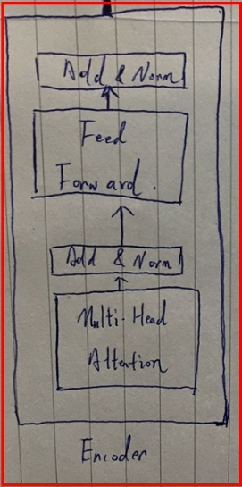

Encoder 裡面這些一層一層的合起來叫做一個 EncoderLayer : 

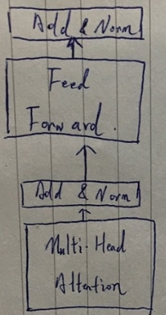

這四個合起來叫一層，Hulit-Head-Attention 與 Feed-Forward 這邊稱之為 Sub-Layer，出了 2 個 Sub-Layer 之外我們還可以看到 Add&Normal 步驟。具體 Add&Normal 在幹嘛起初我是真的無法理解，這邊我直接放 LeeMeng 老師的原話，不想理解就當背公式好了 : 

<br>

>_在 Add & Norm 步驟裡頭，每個 sub-layer 會有一個[殘差連結（residual connection）](https://www.cv-foundation.org/openaccess/content_cvpr_2016/papers/He_Deep_Residual_Learning_CVPR_2016_paper.pdf)來幫助減緩梯度消失（Gradient Vanishing）的問題。接著兩個 sub-layers 都會針對最後一維 d_model 做 [layer normalization](https://arxiv.org/abs/1607.06450)，將 batch 裡頭每個子詞的輸出獨立做轉換，使其平均與標準差分別靠近 0 和 1 之後輸出。另外在將 sub-layer 的輸出與其輸入相加之前，我們還會做點 regularization，對該 sub-layer 的輸出使用 dropout。總結一下。如果輸入是 x，最後輸出寫作 out 的話，則每個 sub-layer 的處理邏輯如下：_

<br>

```py
sub_layer_out = Sublayer(x) # 先進 sub-layer 計算結果
sub_layer_out = Dropout(sub_layer_out) # 對結果套用 dropout，做 regularization。
out = LayerNorm(x + sub_layer_out) # 使其平均與標準差分別靠近 0 和 1 之後輸出
```

<br>

後來我覺得還是要探求真理，所以挖掘了一下關於 LayerNormalization 與 Dropout 相關知識，這兩兄弟其實都是 Model 優話操作，相關知識我會整理一下放在另兩篇筆記中，有需求可以傳送過去看看 :

1. LayerNormalization（[傳送](../BN2LN/README.md)）

2. Dropout （[傳送](../Dropout/README.md)）

<br>

上面這一段話不想理解或不想傳送走的話，不多說就直接照搬 code 吧，佛系一點時間到了自然就會 :

```py
#  實作 EncoderLayer
class EncoderLayer(tf.keras.layers.Layer):
  # Transformer 論文內預設 dropout rate 為 0.1，其他參數略過。
  def __init__(self, d_model, num_heads, dff, rate=0.1):
    super(EncoderLayer, self).__init__()

    # 建立 2 個 Sub-Layer mha丶ffn
    self.mha = MultiHeadAttention(d_model, num_heads)
    self.ffn = point_wise_feed_forward_network(d_model, dff)

    # layer norm 很常在 RNN-based 的模型被使用。一個 sub-layer 配一個 layer norm
    self.layernorm1 = tf.keras.layers.LayerNormalization(epsilon=1e-6)
    self.layernorm2 = tf.keras.layers.LayerNormalization(epsilon=1e-6)
    
    # 一樣，一個 sub-layer 一個 dropout layer
    self.dropout1 = tf.keras.layers.Dropout(rate)
    self.dropout2 = tf.keras.layers.Dropout(rate)
    
  # 需要丟入 `training` 參數是因為 dropout 在訓練以及測試的行為有所不同
  def call(self, x, training, mask):
    # 除了 `attn`，其他張量的 shape 皆為 (batch_size, input_seq_len, d_model)
    # attn.shape == (batch_size, num_heads, input_seq_len, input_seq_len)
    
    # sub-layer 1: MHA
    # Encoder 利用注意機制關注自己當前的序列，因此 v, k, q 全部都是自己
    # 另外別忘了我們還需要 padding mask 來遮住輸入序列中的 <pad> token
    attn_output, attn = self.mha(x, x, x, mask)  
    attn_output = self.dropout1(attn_output, training=training) 
    out1 = self.layernorm1(x + attn_output)  
    
    # sub-layer 2: FFN
    ffn_output = self.ffn(out1) 
    ffn_output = self.dropout2(ffn_output, training=training)  # 記得 training
    out2 = self.layernorm2(out1 + ffn_output)
    
    return out2
```