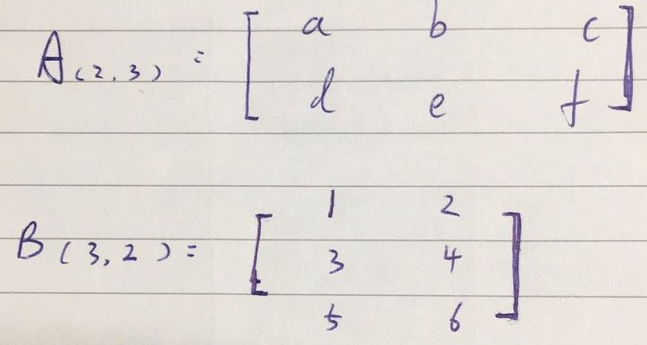
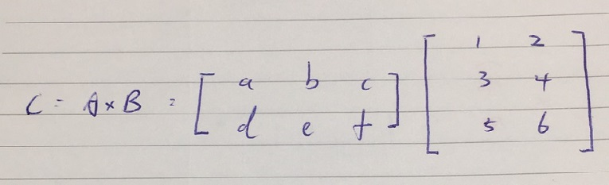
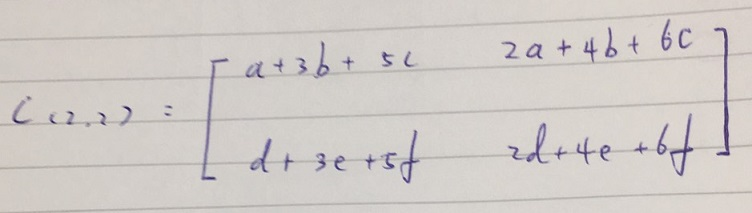
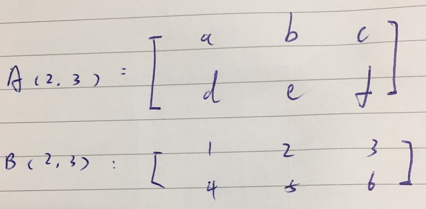
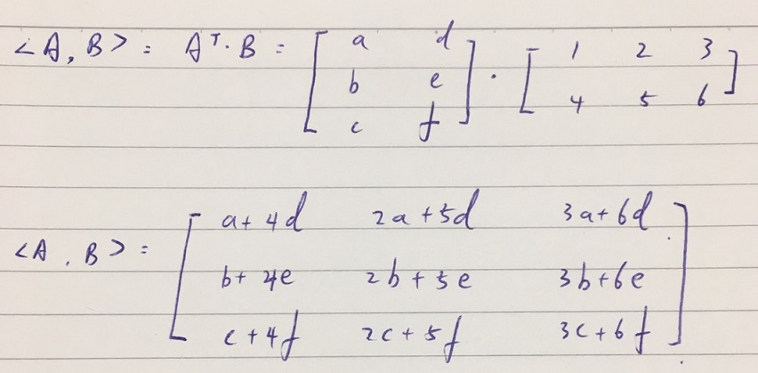

# Dot Product 基礎

 

---

 

這邊簡單補充一下矩陣乘法知識，要想掌握深度學習，矩陣觀念真的十分重要，光是這裡的補充是不太夠的。接下來往正深層走的話還需要自行去找資源學習矩陣與線性代數。再次說明，這邊的補充只是為了應付 Transformer 裡面的一些運算。

 

---

 

## 一丶矩陣乘法

 

首先是矩陣乘法概念，這邊其實去網路上找資源就可以了，一部影片大概 3-4 分鐘就可以交代清楚矩陣乘法。

今天有 2 個矩陣:

* `A(m, n)`  m 列, n 行
* `B(n, p)`  n 列, p 行

我們把這兩個矩陣相乘得到一個新的矩陣 `C(m, p)`

 

其實就這麼簡單，但是我們要注意一些規則。

* 當兩個矩陣要相乘，前一個矩陣的 __行__ 必須等於後一個矩陣的 __列__ 才能執行。也就是 `A(m, n) * B(n, p)` 時， A 的行 n 等於 B 的列 n，所以可以執行。

* 兩個矩陣相乘後，得到結果的行列長度為前一個的 __列__，後一個的 __行__。

 

我們直接舉例說明 : 

我們有一對矩陣 A 與 B :

先判斷它們是否達成可以相乘條件 : A 的行等於 B 的列條件達成，可以做相乘。

 

所以我們可以寫成這樣的形式：

 

根據規則，我們可以知道算出來的結果形狀是 A 列 B 行。在本例中也就是 `C(2, 2)`，所以最終結果為 : 

這邊看不懂的話，提供一個教學資源參考用 : [矩陣的運算-矩陣的乘法說明](https://www.youtube.com/watch?v=5GGiqiQlpaA)
 

---

 

## 二丶點(內)積運算

 

上面的矩陣乘法是基礎，下面這邊講到的就是我們在 Transformer 中多次看到的 dot product 了。如果你以為 dot product 就是矩陣相乘那就大錯特錯。先看定義 : 

今天有兩個矩陣 : 

* `A(m, n)`

* `B(m, n)`

今天要對這兩個矩陣做內積 : 

A 與 B 座內積寫法 : `<A, B>`，實際運算等於 A 轉置ㄏ後再乘 B。

舉實際範例 :

A 矩陣與 B 矩陣 : 

 

dot product 運算 : 

