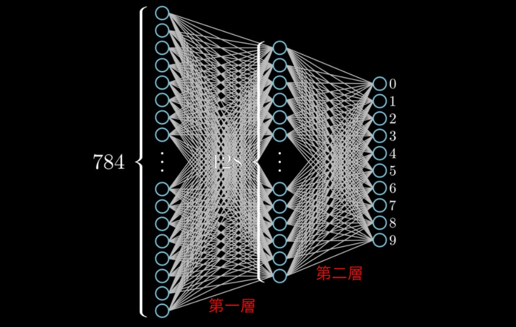

# 深度學習入門介紹

 

---

 

## 一丶深度學習 4 大步驟

首先，訓練深度學習模型其實簡單概要一共就是 4 個步驟，分別是:

1. input 一組資料（x, y），目標與輸出。

2. 經過模型（Ｗeight * x + bias）訓練的出一個 __predict_y__ 值，當然因為初始化階段模型的 Weight 跟 bias 都是隨機生成的，所以出來的 predict_y 也是一個相對的隨機值。

3. 然後把得出的 predict_y 與 y 放入一個叫做 loss_func 的函式中運算並得到一個 loss 值。loss_func 簡化來講如下 : 

    loss = （y - predict_y）^2

    其實 loss 就是預測與實際值的開平方。

4. 最後拿這個 loss 值丟入 optimizer 中，optimizer 連接著整個神經網路，其中的設計使用到梯度下降的數學概念，待會我們單獨來講，這邊就想像說我們拿到 loss 值之後，這個 optimizer 自己就知道該怎麼調整神經網路的參數了，也就是上面步驟 3 提到的 Weight 與 bias。緊接著 optimizer 就自己去模型中修改參數，嘗試把運算結果向 y 值靠攏。

以上這 4 個步驟，在深度學習中會被重複數萬，甚至數百萬遍。讓機器閱讀每一份資料，並去習慣資料。圖示如下(p1-1):

 
 
 

## 二丶重點知識

下面涉及到深度學習的重點知識整理，幾乎都是數學觀念。

 
 

### 1. 關於資料

首先介紹到對於深度學習如何建置資料的概念。假如我們今天有一堆手寫阿拉伯數字灰階圖片，我們想讓機器學會自己去認這些圖片給圖片做 0~9 分類。我們不可能把圖片資料就這樣直接餵進去給模型。所以我們需要整理資料，把他整理成機器看得懂的資料。

首先我們先假設圖片為灰階長寬 28px*28px，一共 10000 張。第一步要做的事情是就是把圖片資料由灰階轉為黑白(單純黑白在顏色表示上就可以是 0 or 1)。原本一張圖片資料是一個 28*28 的 1D 張量。例如:

    pic =   [
                [12, 45, 23, ..., 24, 155, 233],
                [12, 31, 78, ..., 24, 24, 245],
                [45, 45, 46, ..., 24, 176, 36],
                            ......
                [155, 45, 23, ..., 24, 215, 21],
                [75, 64, 11, ..., 24, 57, 245],
                [125, 45, 23, ..., 24, 22, 61],
            ]

 我們要把這些 0~255 的資料先轉為 0 or 1(純黑白)，方法可以是 int(pic/255) 取整數。然後在 reshape 成一個 784(28*28) 維向量。

    pic = [1, 1, 0, 1, 1, 0, 1, 0, ..., 1, 1, 0]

今天有 10000 筆資料，所以我們最終會得到一個 2D 張量 shape = (10000, 784)

    pics = [
        [1, 1, 0, 1, 1, 0, 1, 0, ..., 1, 1, 0],
        [1, 1, 0, 1, 1, 0, 1, 0, ..., 1, 1, 0],
        [1, 1, 0, 1, 1, 0, 1, 0, ..., 1, 1, 0],
                        ......
        [1, 1, 0, 1, 1, 0, 1, 0, ..., 1, 1, 0],
        [1, 1, 0, 1, 1, 0, 1, 0, ..., 1, 1, 0],
        [1, 1, 0, 1, 1, 0, 1, 0, ..., 1, 1, 0],
    ]

然後我們再來思考關於 y (輸出) 的概念，假如我們事先人工標記每一張圖片的分類，是甚麼阿拉伯數字就是哪一個數字分類。今天要預測的結果是 1~10 的分類，對深度學習敏感的人一看就知道這種多類別分類結果會是一個 10 維向量，所以我們把人工標記的 Label 變成如下資料。

    _0_ = [1., 0., 0., 0., 0., 0., 0., 0., 0., 0.]
    _1_ = [0., 2., 0., 0., 0., 0., 0., 0., 0., 0.]
                        ......
    _9_ = [0., 0., 0., 0., 0., 0., 0., 0., 0., 1.]

目前為止我們已經成功整理好了輸入的 x, y 資料。x = pics, y = labels

 
 
 

### 2. 模型

深度學習的核心就是模型了。在深度學習中我們建立設計的模型都是一層一層堆疊起來的，像是搭機木。

先上圖: 

在圖中，我們可以看到一共有2層 Model，第一層有 128 個神經元，也可以理解成 input，第二層有 10 個神經元。一張圖片 input 784 個值進入到 Model 之中，經過 Model 層層轉換之後，會得到最終的預測結果。

我們可以想像 784 到 128 的這一過程，第一層 Model 跟每一個 input 都緊密相連。我們可以理解為 128 神經元需要看到完整的圖片資訊。

假設每一個神經元的 activation function 如下 :

    act_func = pics * Weight + bias

這我們先前也提到過，如果理解的話，第二層亦是如此。只不過我們需要在第二層做一個 softmax 的動作，白話講就是做加權平均。最終結果大致上如下:

    eg = [0.1, 0.0, 0.3, 0.6, 0.0, 0.0, 0.0, 0.0, 0.0, 0.0]

    如果預測結果如上那我們基本上就可以說這張圖是被分類為 3。當然，這個預測結果是不準確的，因為還沒有跟實際 y 做 loss 並反向傳播做 Model 提升。

 
 
 

### 3. loss func

損失函數是深度學習中是扮演一個評判學習好壞的角色，上面概要的時候也提到說，他其實簡單點講就是算實際值與預測值的差。這邊重新 show 一次公式:

    loss = （y - predict_y）^2

其實實務上， loss_func 不可能這麼簡單的，keras 框架提供的 loss_func 就有很多種，應運不同情境有不同的 loss_func 來應對，這篇就不一一列舉了，但是原理其實都一樣，就是在算差值。

 
 
 

### 4. Optimizer

最後是我們的優化器部分，優化器就是深度學習中幫助 Model 產生智慧的一塊模組。籠統一點來說，他就是取得 loss 數值，然後對 Model 的參數做出調整，上面也說過了。那在這邊我們就稍微深入一點來探討一下其核心原理。

我們再重新把目光放回上一步的 loss_func。

    loss = (predict_y - y)^2
    # 展開
    loss = ((Weight*x) -y)^2 # 這邊我把 bias 省掉，簡化為了方便理解。 

因為我們的 input 資料是固定(x, y 固定)，所以我們基本上可以說，變數只有 Weight 一個。也就是這樣:

    loss = (Weight)^2

我們把線畫出來大致上如下，可以看到我們的 W 跟 loss 之間的關係。:

當今天的 W 在藍點上時，我們對其做一次微分。f'(W) 取得當前 W 所在位置的斜率。畫出來如下:

取得斜率之後，根據斜率正負，我們的 Optimizer 就知道該把 Weight 往其些綠相反方向調整，那究竟該調整多少呢，這就涉及到 learning_rate 的概念了。簡單理解就是 learning_rate 越大，Weight 調整時移動的幅度越大。或者根據斜率的大小去推算移動間距。

事實上呢，這種計算2元方程式微分事在算點斜率，如果今天換成張量，針對張量做微分我們叫做算 __梯度__。這是一個很重要的名詞。當然張量微分顯然不是那麼簡單的，所以這邊舉例還是用2元方程式做微分來取代。

找到新的 Weight 之後，Optimizer 就會回去修改 Model 裡面的 Weight 與 bias。周而復始直到訓練週期結束。

這種根據梯度調整 Weight 的方式叫做梯度下降（英語：Gradient descent），針對梯度下降其實還有很多重要觀念，這邊就不多說，有需要就另外去找資料吧，列舉不完了。

 
 
 
 

以上就是我整理的深度學習入門知識。